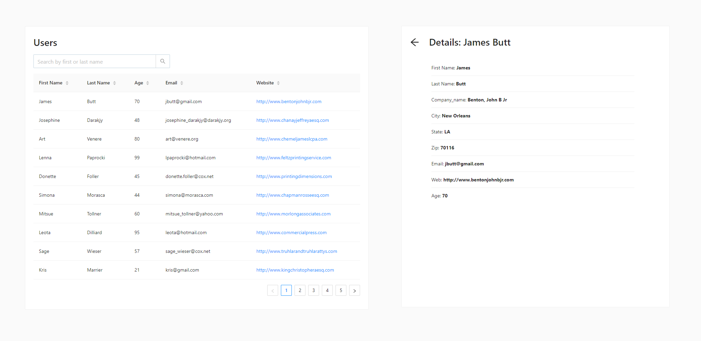

# React Assignment

In this assignment, you have to create a react application which provides following functionalities:

- list users in a table
- search for a user
- sort columns of table
- pagination of users list
- detail page for each user on a separate route

_Attention to detail and meeting all requirements is important in the project. Completing it in less time will not give you any preference._

## **Task Overview**

App functions:

- **Table:** The main screen should list all users in the table
  - columns to show: `first_name`, `last_name`, `age`, `web` and `email`
  - clicking on first name should open `Details` page on a separate route
  - website links (`web`) should open in a new browser tab
- **Search**: Allow to **search** using first_name or last_name
- **Pagination**: Data should be paginated
- **Sort**: All columns should be sortable in both ascending and descending order
- **Detail**: Detail page should show all fields of user
  - Clicking on **back** navigates back to Users table page
- **Routing**: Table and Detail pages should be on their respective routes:
  - Route for Table page should be `/users`
  - Route for Detail page should `/users/<id>` (e.g: _/users/2_, if id of user is 2)

## API endpoint:

_[https://datapeace-storage.s3-us-west-2.amazonaws.com/dummy_data/users.json](https://datapeace-storage.s3-us-west-2.amazonaws.com/dummy_data/users.json)_

The user model has following fields:

```tsx
User -
  id -
  first_name -
  last_name -
  age -
  email -
  web -
  company_name -
  city -
  state -
  zip;
```

## **Instructions**

- [ ] Use **react** for this assignment.
- [ ] **IMPORTANT**: Pagination, search and sorting should be implemented manually in the frontend only. **DO NOT** use 3rd party library or inbuilt feature for these.
- [ ] Data should be _fetched_ from the [api provided](#api-endpoint) (and not stored in source code)
- [ ] `yarn start` (or `npm run start` if using npm) should start the app
- [ ] `yarn bulid` (or `npm run build` if using npm) should build the app
- [ ] repo should not contain irrelevant folders/files like node_modules, build directories etc.
- [ ] Follow the [wireframes](#wireframes) provided closely
- [ ] Follow these steps for submission:
  1. Fork the repository
  1. Create issues and work on them in their respective branches
  1. Complete the tasks while following all instructions
  1. Create MRs and merge into main branch
  1. When done, Test if all task requirements are met and instructions followed
  1. Push code to github
  1. Deploy and host the app using Github Pages
  1. Reply to the same email with the **repo URL** and **hosted URL**
- For any queries please email us at [hiring@truevalueaccess.com](mailto:hiring@truevalueaccess.com)

## Wireframes:

Wireframes for users table page _(left)_ and user detail page _(right)_

